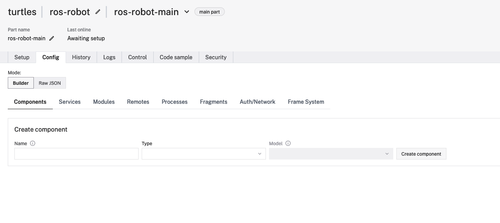

# Viam ROS Camera Wrapper

This has been tested with ROS 1 Noetic, Melodic testing is underway

## ROS Configuration

Our robot was configured with a standard USB camera on both the Melodic and Noetic releases. The [video_stream_opencv](http://wiki.ros.org/video_stream_opencv)
package was used.

If roscore is not running, make sure it is running in one window
```shell
roscore
```
***Note***: for our local testing we only start ROS when testing

In another window start our camera publisher node
```shell
roslaunch video_stream_opencv camera.launch
```
If there are multiple cameras we need to set the appropriate video stream provider argument.

List the camera topics
```shell
rostopic list 
/camera/camera_info
/camera/camera_stream/parameter_descriptions
/camera/camera_stream/parameter_updates
/camera/image_raw
/camera/image_raw/compressed
/camera/image_raw/compressed/parameter_descriptions
/camera/image_raw/compressed/parameter_updates
/camera/image_raw/compressedDepth
/camera/image_raw/compressedDepth/parameter_descriptions
/camera/image_raw/compressedDepth/parameter_updates
/camera/image_raw/theora
/camera/image_raw/theora/parameter_descriptions
/camera/image_raw/theora/parameter_updates
/rosout
/rosout_agg
```
### Noetic

Tested & working

### Melodic

Currently still testing with ROS Melodic

### To consider


### Possible issues
When installing `viam-sdk` on jetson running ROS 1 Melodic, it will be required to download and compile Python3.9

## Setup Viam Remote

```shell
git clone https://github.com/shawnbmccarthy/viam-ros-camera-wrapper
cd viam-components-camera-wrapper
./setup_venv.sh
```
This will install our python virtual environment and install the required packages

## Configure Robots remote resources

The viam server component interface allows us to create custom components which interface 
with the `viam-server` using the viam SDK's. Our example makes use of the [Python SDK](https://python.viam.dev/)
to create custom sensors.


1. log into [app.viam.com](https://app.viam.com)
2. access the robot you configured, and go to the modules tab


3. give the module a name, for this example lets use `ros-module` as the name, next set the executable to the run_module.sh (using the full path):


4. Now that we have created our module, we need to add the components, select `Components` tab


5. this module contains two components, a camera and a sensor. To add the camera enter:
   1. enter general name for the camera component (`ros_camera_demo` or anything you prefer)
   2. Select camera from the type drop down
   3. enter `viamlabs:ros:camera` as the type
   4. select create component
   5. in the attributes window enter `{"topic": "ROS_CAMERA_TOPIC"}`, where `ROS_CAMERA_TOPIC` is the topic that produces images
   6. select save
6. to add the sensor component
   1. enter general name for the sensor component (`ros_sensor_demo` or anything you prefer)
   2. Select sensor from the type drop down
   3. enter `viamlabs:ros:sensor` as the type
   4. select create component
   5. in the attributes window enter `{"topic": "ROS_SENSOR_TOPIC"}`, where `ROS_SENSOR_TOPIC` is the topic that produces images
   6. select save


Now go back to [app.viam.com](https://app.viam.com) and select the `Control` tab of your robot and select `Sensors`, 
here we can select `Get All Readings` to see the output

And go to the camera to view the image


To see how the code works view: [camera_remote.py](camera_remote.py) and [ros_camera.py](ros_camera.py)

## Further activities
Testing and updates to add more topics

# contact

For any questions, please email me at: [shawn@viam.com](mailto:shawn@viam.com)

# References
1. [viam](https://viam.com)
1. [viam cloud](https://app.viam.com)
1. [viam docs](https://docs.viam.com)
1. [viam python sdk](https://python.viam.dev)
1. [sdk as server](https://docs.viam.com/product-overviews/sdk-as-server/)
1. [subclassing components](https://python.viam.dev/examples/example.html#subclass-a-component)
1. [drive a rover](https://www.viam.com/resources/try-viam)
